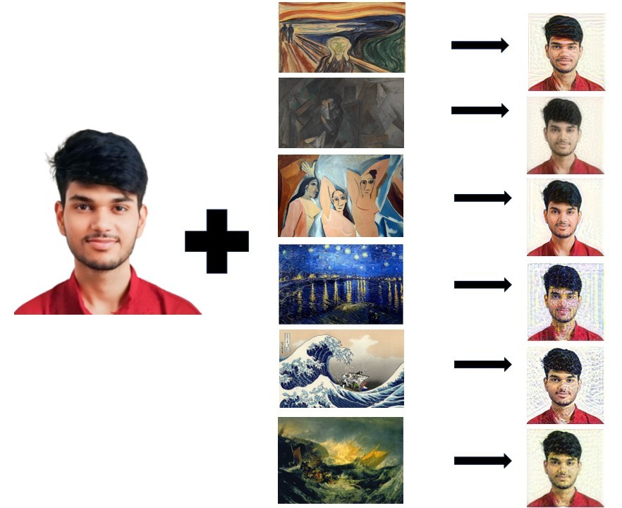

# Neural Style Transfer Web Application

A complete web-based Neural Style Transfer application that allows users to transform images by applying artistic styles using deep learning. The application features a modern browser interface and supports both default images and custom uploads.

**Author:** Anant Shukla (23113024)  
**Department:** Civil Engineering, IIT Roorkee

## Try Your Own Photo

Try your own photo here: [Neural Style Transfer Web App](http://localhost:5000)

*Note: Make sure the web application is running locally. For deployment instructions, see the "Running the Application" section below.*

## Project Overview

This project implements Neural Style Transfer (NST) using VGG19, a deep convolutional neural network pretrained on ImageNet. The system applies the artistic style from one image to the content of another, creating visually stunning hybrid images that preserve the structure of the content while adopting the style characteristics.

### Key Features

- **Web-based Interface**: User-friendly browser interface for easy interaction
- **Flexible Image Selection**: Choose from default images or upload your own
- **Configurable Parameters**: Adjust epochs, learning rate, and loss weights
- **Real-time Generation**: Generate stylized images with progress feedback
- **Modern UI**: Responsive design that works on desktop and mobile devices

## Neural Style Transfer Explanation

Neural Style Transfer is a technique that uses deep learning to separate and recombine the content and style of images. The process works as follows:

1. **Feature Extraction**: A pretrained VGG19 network extracts high-level features from both content and style images
2. **Content Representation**: The content image's features are captured at a specific layer (block4_conv2) that preserves structural information
3. **Style Representation**: The style image's features are captured at multiple layers and converted to Gram matrices, which capture texture and style patterns
4. **Optimization**: An optimization process (gradient descent) iteratively modifies a generated image to:
   - Minimize the difference with content features (content loss)
   - Minimize the difference with style Gram matrices (style loss)
5. **Output**: The result is a new image that combines the content structure with the artistic style

### Technical Details

- **Model**: VGG19 (pretrained on ImageNet, top layers removed)
- **Content Layer**: `block4_conv2` - captures high-level content structure
- **Style Layers**: `block1_conv1`, `block2_conv1`, `block3_conv1`, `block4_conv1`, `block5_conv1` - capture style at multiple scales
- **Loss Functions**: 
  - Content Loss: Mean Squared Error between feature representations
  - Style Loss: Mean Squared Error between Gram matrices
- **Optimizer**: Adam optimizer with configurable learning rate

## Folder Structure

```
Neural_Style_Transfer_WebApp/
│
├── app.py                       # Flask backend application
├── requirements.txt             # Python dependencies
├── README.md                    # This file
│
├── contentimage/                # Default content images (PRE-EXISTING)
│   └── new.png                  # Default content image
│
├── style_images/                # Default style images (PRE-EXISTING)
│   ├── Der Schrei.jpeg
│   ├── Femme nue assise.jpg
│   ├── Les Demoiselles d'Avignon.jpg
│   ├── Night canvas.jpg
│   ├── The Great Wave off Kanagawa.jpg
│   └── the_shipwreck_of_the_minotaur.jpg
│
├── uploads/                     # User-uploaded images
│   ├── content/                 # Uploaded content images
│   └── style/                   # Uploaded style images
│
├── outputs/                     # Generated stylized images
│   └── generated_*.png         # Output files with timestamps
│
├── src/                         # Core NST modules
│   ├── __init__.py
│   ├── model.py                 # VGG19 feature extractor
│   ├── losses.py                # Content, style, and Gram matrix losses
│   ├── style_transfer.py        # Main NST optimization loop
│   └── utils.py                 # Image loading, preprocessing utilities
│
├── templates/                   # HTML templates
│   └── index.html               # Main web interface
│
└── static/                      # Static assets
    └── css/
        └── style.css            # Styling for web interface
```

## Installation Steps

### Prerequisites

- Python 3.8 or higher
- pip (Python package manager)
- 4GB+ RAM recommended (8GB+ for better performance)
- Optional: GPU with CUDA support for faster processing

### Step 1: Clone the Repository

```bash
git clone <repository_url>
cd Neural_Style_Transfer_WebApp
```

### Step 2: Create Virtual Environment (Recommended)

```bash
# On Windows
python -m venv venv
venv\Scripts\activate

# On Linux/Mac
python3 -m venv venv
source venv/bin/activate
```

### Step 3: Install Dependencies

```bash
pip install -r requirements.txt
```

This will install:
- Flask (web framework)
- TensorFlow (deep learning library)
- NumPy (numerical computing)
- Pillow (image processing)
- Werkzeug (WSGI utilities)

**Note**: TensorFlow installation may take several minutes. For GPU support, install `tensorflow-gpu` instead of `tensorflow` (requires CUDA setup).

### Step 4: Verify Installation

```bash
python -c "import tensorflow as tf; print(tf.__version__)"
python -c "import flask; print(flask.__version__)"
```

## Running the Application

### Start the Web Server

```bash
python app.py
```

The application will start on `http://localhost:5000` (or `http://0.0.0.0:5000`).

### Access the Web Interface

Open your web browser and navigate to:
```
http://localhost:5000
```

### Stop the Server

Press `Ctrl+C` in the terminal to stop the server.

## Usage Guide

### Using Default Images

1. **Select Content Image**:
   - Choose "Use Default Image" option
   - Select from the dropdown menu (currently: `new.png`)

2. **Select Style Image**:
   - Choose "Use Default Image" option
   - Select from the dropdown menu (6 available style images)

3. **Adjust Parameters** (optional):
   - **Epochs**: Number of optimization iterations (default: 10)
   - **Learning Rate**: Optimization speed (default: 5.0)
   - **Content Weight**: How much to preserve content (default: 10000)
   - **Style Weight**: How much to apply style (default: 0.01)

4. **Generate**:
   - Click "Generate Stylized Image" button
   - Wait for processing (may take 1-5 minutes depending on hardware)
   - View results in the Results section
   - Download the generated image

### Uploading Custom Images

1. **Upload Content Image**:
   - Choose "Upload Custom Image" option
   - Click "Choose File" and select your image
   - Supported formats: PNG, JPG, JPEG, GIF, BMP, TIFF, WEBP
   - Maximum file size: 16MB

2. **Upload Style Image**:
   - Choose "Upload Custom Image" option
   - Click "Choose File" and select your style image
   - Same format and size restrictions apply

3. **Generate**:
   - Follow the same steps as above

### Tips for Best Results

- **Content Images**: Work best with clear subjects and good contrast
- **Style Images**: Artistic paintings, textures, and patterns produce interesting results
- **Image Size**: Larger images take longer but may produce better results
- **Parameters**:
  - Increase `content_weight` to preserve more original structure
  - Increase `style_weight` to apply stronger style effects
  - More `epochs` generally improve quality but take longer
  - Higher `learning_rate` speeds up but may reduce quality

## Configuration Parameters

### Epochs
- **Range**: 1-50
- **Default**: 10
- **Description**: Number of training iterations. More epochs = better quality but longer processing time.

### Learning Rate
- **Range**: 0.1-20.0
- **Default**: 5.0
- **Description**: Step size for optimization. Higher values converge faster but may overshoot optimal values.

### Content Weight
- **Range**: 1000-100000
- **Default**: 10000
- **Description**: Weight for content loss. Higher values preserve more of the original image structure.

### Style Weight
- **Range**: 0.001-1.0
- **Default**: 0.01
- **Description**: Weight for style loss. Higher values apply stronger style effects.

## Example Results

The application can produce various artistic effects:

- **Photographic to Painting**: Transform photos into paintings in the style of famous artists
- **Texture Transfer**: Apply textures and patterns to images
- **Artistic Filters**: Create unique artistic interpretations of images

Example combinations:
- Content: Portrait photo + Style: Van Gogh → Artistic portrait
- Content: Landscape + Style: Abstract art → Stylized landscape
- Content: Architecture + Style: Watercolor → Painted architecture

### Sample Results



*Example of style transfer results showing the content image transformed with different artistic styles.*

## Troubleshooting

### Common Issues

1. **"Module not found" errors**:
   - Ensure virtual environment is activated
   - Reinstall requirements: `pip install -r requirements.txt`

2. **Out of memory errors**:
   - Reduce image size in `src/utils.py` (change `max_size` parameter)
   - Close other applications to free RAM
   - Use smaller images

3. **Slow processing**:
   - Normal for CPU-only systems (1-5 minutes per image)
   - Consider using GPU for faster processing
   - Reduce number of epochs

4. **Images not loading**:
   - Check that `contentimage/` and `style_images/` folders exist
   - Verify image file formats are supported
   - Check file permissions

5. **Port already in use**:
   - Change port in `app.py`: `app.run(port=5001)`
   - Or stop other applications using port 5000

## Future Scope

### Planned Enhancements

1. **Fast Neural Style Transfer**:
   - Implement feed-forward networks for real-time style transfer
   - Pre-train style-specific models for instant results

2. **Real-time Style Transfer**:
   - Video processing capabilities
   - Live camera feed styling

3. **GPU Optimization**:
   - Automatic GPU detection and utilization
   - Batch processing for multiple images

4. **Mobile/Web Deployment**:
   - Convert to TensorFlow.js for browser-based processing
   - Progressive Web App (PWA) support
   - Cloud deployment options (Heroku, AWS, GCP)

5. **Advanced Features**:
   - Multiple style blending
   - Style interpolation
   - Region-specific style application
   - Style transfer presets
   - History and gallery of generated images

6. **Performance Improvements**:
   - Model quantization for faster inference
   - Caching of style features
   - Asynchronous processing with job queues

7. **User Experience**:
   - Progress bars with ETA
   - Image comparison slider
   - Before/after preview
   - Social sharing capabilities

## Technical Architecture

### Backend (Flask)
- RESTful API design
- File upload handling
- Image processing pipeline
- Error handling and validation

### Frontend (HTML/CSS/JavaScript)
- Responsive design
- Dynamic image loading
- Form validation
- Progress indicators

### Machine Learning Pipeline
- VGG19 feature extraction
- Gram matrix computation
- Gradient-based optimization
- Image preprocessing/postprocessing

## Contributing

Contributions are welcome! Please feel free to submit pull requests or open issues for bugs and feature requests.

## License

This project is licensed under the MIT License - see the LICENSE file for details.

## Acknowledgments

- VGG19 model: Simonyan & Zisserman (2014) - "Very Deep Convolutional Networks for Large-Scale Image Recognition"
- Neural Style Transfer: Gatys et al. (2015) - "A Neural Algorithm of Artistic Style"
- TensorFlow team for the deep learning framework
- Flask team for the web framework

## Contact

**Author:** Anant Shukla  
**Roll Number:** 23113024  
**Department:** Civil Engineering, IIT Roorkee

For questions, issues, or contributions, please open an issue on the repository.

---

**Note**: This application requires significant computational resources. Processing times vary based on hardware (CPU vs GPU) and image sizes. For production use, consider deploying on GPU-enabled servers or cloud platforms.
